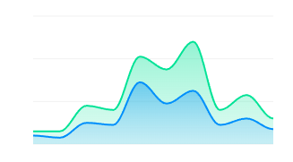
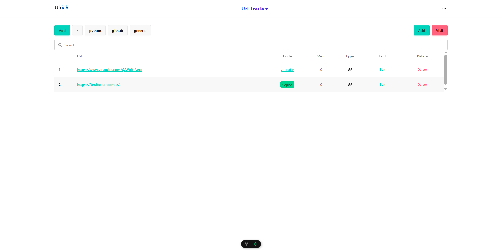
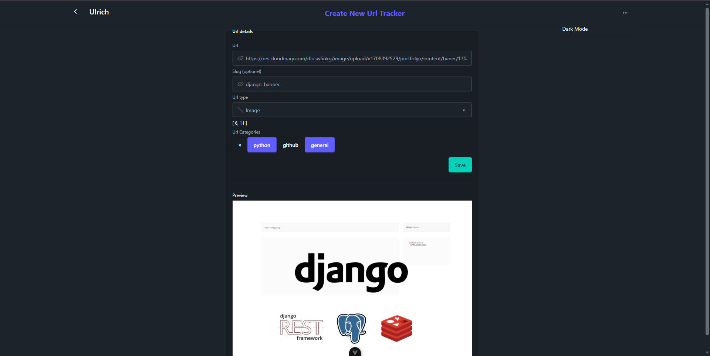

# URL Shortener & Tracker


||A lightweight URL shortening service with built‑in analytics. Create short links, track clicks in real time, and understand your traffic without external tools.|
|---|---


> Preview

|||
|---|---


## Features

* 🔗 Shorten long URLs into clean, shareable links
* 📊 Click tracking (total, unique, timestamp, referrer)
* 🌍 Geo & device analytics (optional)
* ⏱ Real‑time statistics dashboard
* 🔐 Optional authentication & private links
* 🧩 RESTful API

## Use Cases

* Marketing campaign tracking
* Sharing clean links on social media
* Measuring link performance
* Internal tooling / personal analytics

## Tech Stack (example)

* Backend: FastAPI
* Database: PostgreSQL
* Frontend (optional): Vue.js 
* Analytics: IP + User‑Agent parsing
* Auth (admin): TOKEN

## How It Works

1. User submits a long URL
2. App generates a unique short code
3. Short URL redirects to the original URL
4. Each redirect logs analytics data

## API Overview

### Create Short URL

`POST /api/shorten`

**Request**

```json
{
  "url": "https://example.com/very/long/url"
}
```

**Response**

```json
{
  "r": "https://your.app/aZ3kQ"
}
```

### Redirect & Track

`GET /:code`

* Redirects to original URL
* Logs click metadata automatically

### Get Stats

`GET /api/stats/:code`

Returns click count, timestamps, referrers, devices, etc.

## Tracking Data

* Total clicks
* Unique visitors
* Date & time
* Referrer
* Device / OS / Browser
* Country / city (if enabled)

## Privacy Notes

* IPs can be anonymized
* No cookies required
* GDPR‑friendly setup possible

## Setup (Local)

```bash
git clone [https://github.com/yourname/url-shortener](https://github.com/farukseker/Fast-URL-Shortener-Tracker)
cd url-shortener
npm install
npm run dev
```

Environment variables:

* `BASE_URL`


## Roadmap

* Custom aliases
* Expiration dates
* QR code generation
* Webhooks
* Rate limiting

## License

GNU Affero General Public License v3.0

---

Feel free to adapt this README to your stack or deployment style.
